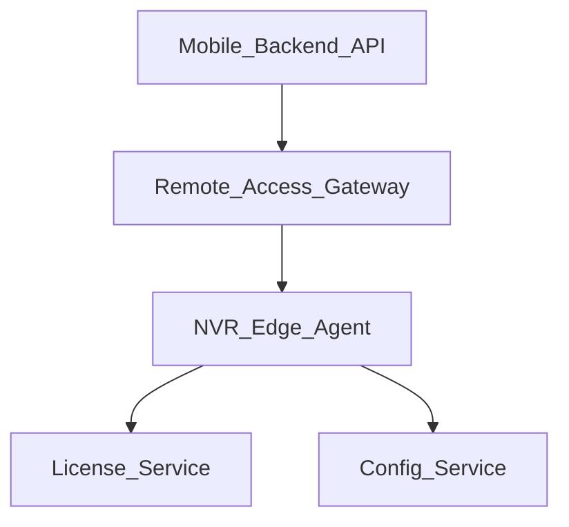

# Архитектура платформы Trassir-класса (вне монорепозитория ядра)

**Назначение:** границы сервисов, угрозы и MVP для **центрального управления**, **облачного доступа**, **HA**, **мобильных клиентов** и **SDK** — без реализации в текущем `nvr_prototype` до закрытия горизонтов 1–2.

## 1. Сервисы (черновик границ)

- **Edge** — текущий регистратор (этот репозиторий): запись, архив, локальный UI.
- **License** — выдача/отзыв билетов, учёт каналов, SKU аналитики.
- **Config** — desired state для парка, версии, канареечные выкаты.
- **Remote access** — outbound-only туннель (mTLS), без белого IP на регистраторе.
- **Mobile backend** — push, тонкие списки камер, прокси HLS/WebRTC (политика продукта).

## 2. Угрозы (кратко)

- Компрометация **License** → массовый отзыв; офлайн-grace на edge.
- **Туннель** — DDoS, перебор сессий; rate limit, device binding, hardware anchor.
- **Хранение биометрии** на централи — 152-ФЗ; минимизация данных, региональные DC.

## 3. HA записи

- Запись **не** дублируется синхронно на два узла без кворума и shared storage; типовые паттерны: актив-пассив с STONITH, или single-writer + async replica для **просмотра**.

## 4. SDK

- Контракт: стабильный **OpenAPI** релизов semver, примеры на JS/C#, политика deprecation.

## 5. MVP платформы (6–12 мес. отдельной команды)

1. Регистратор регистрируется по **одноразовому коду** в License.
2. Центрально виден **инвентарь** и версия прошивки.
3. **Туннель** только для поддержки (временная сессия, аудит).

Дальнейшая детализация — отдельный продуктовый PRD; этот документ — **архитектурное ТЗ-ограничитель** для ядра.
