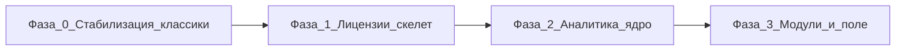

# План развития: видеорегистратор + классические функции + видеоаналитика + лицензии

**Версия плана:** 1.0  
**Дата:** 2026-05-13  
**Область:** один узел (appliance / сервер регистратора), без требования паритета с облачной платформой или кластером Trassir.

---

## 1. Цель и границы

**Цель продукта:** коммерчески пригодный видеорегистратор с:

- полным набором **классических** функций NVR для поля;
- **видеоаналитикой** как набором модулей с понятной стоимостью и включением по лицензии;
- **лицензированием** каналов и/или модулей аналитики с защитой от копирования и поддержкой офлайн-активации.

**Вне скоупа этого плана (явно отложено):** мульти-серверный кластер, собственное мобильное приложение как часть v1, маркетплейс сторонних плагинов без контракта API.

**Текущая база в репозитории:** запись сегментами, архив/ретеншн, HLS, JWT/TOTP, уведомления, ONVIF, Python-хуки, `MotionDetector` + ROI, `PreEventBuffer`, задел API/БД под `ai_models` и `face_persons`, `FaceRecognizer.cpp` — план опирается на это и не предполагает «переписать всё с нуля».

---

## 2. Классические функции регистратора (обязательный минимум для v1)

Ниже — **продуктовый** чеклист; реализация частично уже есть, часть — доработка UI/API/поля.

| Функция | Описание для пользователя | Примечание по продукту |
|--------|---------------------------|-------------------------|
| Запись по расписанию / непрерывно / по событию | Политики записи на камеру | Событийная запись завязана на детектор + пороги |
| Live просмотр | Сетка, полноэкран, стабильный HLS/WebSocket | Нагрузка и SLO — отдельная веха |
| Архив | Поиск по времени/камере, воспроизведение, экспорт | Range/X-Accel, права, аудит экспорта |
| Пользователи и роли | Админ / оператор / просмотр | Уже есть RBAC — расширить матрицу действий под экспорт/настройки |
| Камеры | Добавление RTSP/ONVIF, субпоток, HW-декод | Профили ONVIF — по мере необходимости |
| Диск и хранение | Статус, SMART/место (частично через spawn), политика переполнения | Документировать ограничения |
| Уведомления | Email, Telegram, Webhook | MQTT — контракт и UI: [MQTT_STATUS.md](MQTT_STATUS.md) (`mqtt_delivery: stub` до интеграции брокера) |
| Обновление и откат | `nvr_update.sh`, бэкап/restore | Регресс на поле |
| Киоск / локальный UI | HTTPS, first-run | Уже в фокусе аудита |

**Критерий завершения фазы «Классика v1»:** закрытый чеклист приёмочных тестов на одном эталонном железе + минимальный runbook для инсталлятора.

---

## 3. Видеоаналитика (архитектура и вехи)

### 3.1 Уровни аналитики

1. **Встроенная (без отдельной лицензии или базовый пакет):** движение, ROI, pre/post event, снимки — уже близко к целевому состоянию; нужны стабильность, настройки в UI, метрики ложных срабатываний на поле.

2. **Расширяемая (лицензируемые модули):** линии/зоны пересечения, детекция объекта класса, LPR, лица — единый **конвейер**: источник кадра → даунскейл → инференс (ONNX Runtime / OpenVINO / отдельный worker) → событие в БД → уведомление → отметка на таймлайне архива.

   **Каркас в коде (2026-05):** [`AnalyticsWorker`](../include/nvr/AnalyticsWorker.hpp) — отдельный поток, bounded `ThreadSafeQueue` (`DropOldest`), подписка на [`EventBus`](../include/nvr/EventBus.hpp) для `SystemEvent` (метаданные, без кадров), счётчики Prometheus `nvr_analytics_*`. Инференс и гейты лицензии — следующие вехи.

3. **Интеграция с существующим кодом:** таблицы `ai_models`, `face_persons`, API в `HttpServer` — привести к **единой модели**: «подключённый движок + версия модели + лимит FPS + список камер».

### 3.2 Технические решения (зафиксировать до кодирования модуля 2)

- Формат моделей (ONNX как лингва-франка).
- Где крутится инференс: отдельный процесс vs поток на камеру (влияние на латентность и QSV/VAAPI).
- Политика GPU/CPU и лимиты памяти на камеру.

### 3.3 Вехи аналитики

| Веха | Содержание | Критерий готовности |
|------|------------|---------------------|
| A1 | Спецификация событий аналитики (JSON schema), единая таблица/индексы в БД, отображение в UI списка событий | Документ + миграция + UI список |
| A2 | Плагин-движок v0: один тип детекции (например «зона» или «пересечение линии») на OpenCV/геометрия без NN | Работает на 4 камерах без утечек |
| A3 | Подключение ONNX-модели (одна), конфиг из `ai_models`, включение по камере | Демо на тестовом ролике |
| A4 | Лица: обучение/импорт галереи, порог, аудит (152-ФЗ — внешняя политика продукта) | Согласованный UX + opt-in |
| A5 | Нагрузочный профиль: N камер × M FPS аналитики | Отчёт k6/внутренний bench + лимиты в конфиге |

---

## 4. Лицензирование

### 4.1 Продуктовая модель (выбрать одну основную + опции)

- **Каналы:** максимум одновременно записываемых/отображаемых каналов.
- **Модули аналитики:** отдельные SKU (например «Линия», «LPR», «Лица»).
- **Срок:** бессрочная с подпиской на обновления vs подписка на использование.

Рекомендация для v1: **каналы + бинарные флаги модулей** в одном лицензионном билете, без сложного entitlement-сервера на старте.

### 4.2 Техническая схема (минимально достаточная)

1. **Привязка к железу:** fingerprint (CPU ID, machine-id, MAC — комбинация с salt); хранение только хэша на сервере активации (если будет онлайн).
2. **Билет:** подписанный ключом вендора payload (JSON или protobuf) с `channels`, `modules`, `exp`, `hw_hash`.
3. **Проверка:** при старте демона и раз в N часов — верификация подписи; при нарушении — режим «только просмотр архива» или grace period (продуктовое решение).
4. **Офлайн-активация:** запрос-код из UI → обмен файлами/QR → ввод `.lic` в UI или положить в `/etc/nvr-prototype/`.
5. **Аудит:** логирование активации, смены лицензии, попыток с неверной подписью.

### 4.3 Вехи лицензий

| Веха | Содержание | Критерий |
|------|------------|----------|
| L1 | Спецификация формата билета, пара ключей (dev/prod), утилита `nvr-license-sign` (офлайн) | Документ + CLI |
| L2 | Чтение `.lic` в демоне, API `GET /api/v1/license` (маскированный статус), блокировка добавления камеры сверх лимита | Интеграционные тесты |
| L3 | UI: экран лицензии, ввод кода/файла, отображение срока и модулей | e2e на стенде |
| L4 | Связка с аналитикой: при отсутствии модуля — **403** на AI-эндпоинтах (`/ai/models`, `/ai/faces`, `/events/search` — см. `LICENSE_TICKET.md`); UI может опираться на `modules_bitmask` | Консистентность OpenAPI |

**Юридическое:** тексты EULA и политики обработки биометрии (если аналитика лиц) — вне репозитория, но в плане релиза как блокер для РФ/ЕС при продаже.

---

## 5. Фазы плана (рекомендуемый порядок работ)

| Фаза | Срок (ориентир) | Содержание |
|------|-----------------|------------|
| **0. Стабилизация классики** | 2–4 недели | Закрыть приёмочный чеклист NVR: запись, архив, live, пользователи, диски, уведомления, обновление; стенд + smoke e2e + k6 под целевой профиль; runbook. |
| **1. Лицензии — скелет** | 3–5 недель | Формат билета, подпись, проверка в `main`/HttpServer, лимит каналов, UI статуса; без полного каталога SKU. |
| **2. Аналитика — ядро** | 4–8 недель | Единая модель событий, интеграция с архивом/уведомлениями; первый NN или геометрический модуль по выбору; лимиты FPS/CPU. |
| **3. Модули и поле** | итеративно | Доп. модули под лицензии, жёсткие регрессы на железе заказчика, документация для интеграторов. |

Параллельно (не блокирует фазу 0): дополнение OpenAPI под новые эндпоинты лицензий и аналитики.

---

## 6. Риски и зависимости

- **Железо:** разные CPU/GPU меняют допустимую матрицу «камеры × аналитика» — нужен каталог поддерживаемых конфигураций.
- **Закон:** биометрия и LPR — отдельные юридические и UX-требования (согласие, хранение, экспорт).
- **Безопасность лицензии:** приватный ключ подписи не в репозитории; только в CI/секретах вендора и в утилите подписи.
- **Конкуренция по ощущению:** без стабильного поля и понятных лимитов лицензии «функция есть» не превращается в продукт.

---

## 7. Следующий шаг (одно решение на созвоне)

Зафиксировать в протоколе:

1. Лимит каналов для **первой** коммерческой SKU (например 16/32/64).  
2. Список **первых двух** платных модулей аналитики (из: линия/зона, LPR, лица, детектор объектов).  
3. Онлайн-активация нужна в v1 или достаточно офлайн до v2.

После этого можно разбить фазы 1–2 на задачи в трекере с оценками по спринтам.
